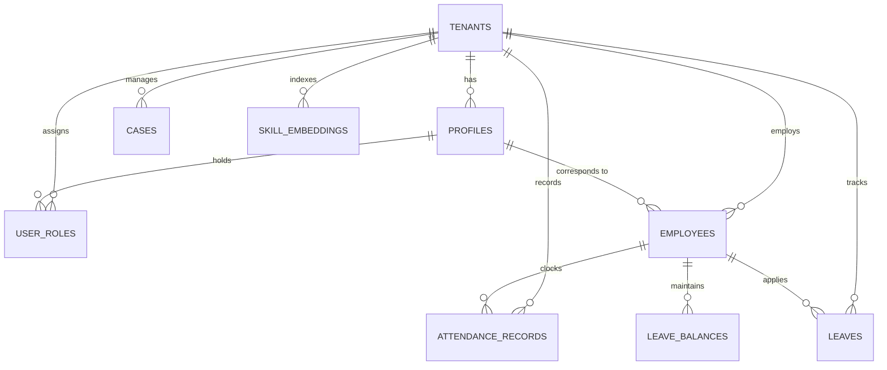
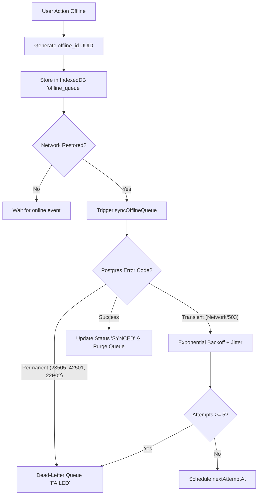

# AttendX v2 — Technical & Product Specification Document

**Version:** 2.0.0  
**Status:** Approved / Active Specification  
**Architecture:** Multi-Tenant PWA (Next.js 16 App Router + Supabase PostgreSQL + IndexedDB Offline Engine)  
**Target Environment:** Node.js 20+ / Supabase Cloud or Managed PostgreSQL 15+ / Render  

---

## Table of Contents
1. [Executive Summary & Purpose](#1-executive-summary--purpose)
2. [System Architecture & Technology Stack](#2-system-architecture--technology-stack)
3. [Multi-Tenancy, Security & RBAC Model](#3-multi-tenancy-security--rbac-model)
4. [Database Schema & Data Models](#4-database-schema--data-models)
5. [Core Functional Modules](#5-core-functional-modules)
   - [5.1 Authentication & Profile Lifecycle](#51-authentication--profile-lifecycle)
   - [5.2 Dynamic Dashboard & Quick Glance](#52-dynamic-dashboard--quick-glance)
   - [5.3 Attendance Tracking & Photo/Geo Verification](#53-attendance-tracking--photo-geo-verification)
   - [5.4 Leave Management & Approval Workflows](#54-leave-management--approval-workflows)
   - [5.5 HR & Workforce Management](#55-hr--workforce-management)
   - [5.6 Manager Workspace & Approvals](#56-manager-workspace--approvals)
   - [5.7 Performance & Peer Recognition](#57-performance--peer-recognition)
   - [5.8 Workplace Cases & Issue Ticketing](#58-workplace-cases--issue-ticketing)
   - [5.9 AI HR Copilot & Knowledge Base RAG](#59-ai-hr-copilot--knowledge-base-rag)
   - [5.10 System Notifications & Announcements](#510-system-notifications--announcements)
6. [Offline-First Architecture & Sync Engine](#6-offline-first-architecture--sync-engine)
7. [Design System & UI/UX Standards](#7-design-system--uiux-standards)
8. [API Route Specifications](#8-api-route-specifications)
9. [Deployment, Environment & Infrastructure](#9-deployment-environment--infrastructure)
10. [Testing & Quality Assurance Plan](#10-testing--quality-assurance-plan)

---

## 1. Executive Summary & Purpose

**AttendX v2** is an enterprise-grade, multi-tenant Workforce Management and Attendance Progressive Web Application (PWA). It provides organizations with unified attendance logging (with photo verification and geocoding), leave management, team oversight, HR administration, workplace issue tracking, performance reviews, and an AI HR Copilot with RAG policy search.

### Core Objectives
1. **Zero-Trust Multi-Tenancy**: Guaranteed database-level isolation between organizations using PostgreSQL Row Level Security (RLS).
2. **Reliable Offline-First Operation**: Field workers and remote staff can clock in, submit leave, and log cases without an active network connection; operations sync reliably upon reconnect.
3. **Audited & Secure Operations**: Immutable audit trails for privileged actions, hardened database definer functions, and column-level protection against privilege escalation.
4. **Tactile Depth Design System**: Modern, responsive UI utilizing a custom neumorphic + glassmorphic design system supporting Light, Dark, and High-Contrast modes.

---

## 2. System Architecture & Technology Stack

```
+-----------------------------------------------------------------------------------+
|                                  CLIENT (PWA)                                     |
|  - Next.js 16 (React 19, Turbopack, App Router)                                   |
|  - TanStack React Query v5 (Data Fetching & Cache) + Zustand (Auth Store)         |
|  - IndexedDB (idb) Offline Queue Engine & Form Draft Storage                      |
|  - Design System v3.0 (CSS Variables, Neumorphism, Glassmorphism, Framer Motion) |
+----------------------------------------+------------------------------------------+
                                         | HTTPS / WSS
                                         v
+-----------------------------------------------------------------------------------+
|                        APPLICATION SERVER (Next.js 16 Proxy)                      |
|  - proxy.ts: Edge/SSR Middleware (Session validation, RBAC route gating)          |
|  - App Router: (app) Protected Routes, /admin Portals, /auth Flow                 |
|  - API Route Handlers: Attendance, AI Copilot, RAG, Payroll, Import, Sync         |
+----------------------------------------+------------------------------------------+
                                         | Service Role / Auth JWT
                                         v
+-----------------------------------------------------------------------------------+
|                             DATA LAYER (Supabase / Postgres 15+)                  |
|  - GoTrue Auth (Session tokens with custom tenant_id claims)                      |
|  - 36 Tables with FORCE ROW LEVEL SECURITY (Tenant & Role-based policies)         |
|  - pgvector: ivfflat vector indexes for skill embeddings / HR policy RAG          |
|  - Triggers: Automatic timestamps, profile tampering guards, immutable audit log  |
|  - Supabase Storage: Buckets for attendance selfies, profile avatars, attachments|
+-----------------------------------------------------------------------------------+
```

### Component Details
- **Frontend / Application Framework**: Next.js 16.3+ with React 19 and App Router.
- **Middleware / Proxy**: Next.js 16 `proxy.ts` export with SSR cookie handling (`@supabase/ssr`).
- **Database & Storage**: PostgreSQL 15+ hosted on Supabase (or self-hosted Postgres) with `pgcrypto` and `pgvector`.
- **Offline Persistence**: Client-side IndexedDB database (`attendx-offline`) managed via `idb`.
- **Styling**: Pure CSS design tokens in `design-system.css` — eliminating large external runtime CSS dependencies while enabling high performance.
- **Icons & Visuals**: `lucide-react` with animated micro-interactions via `framer-motion`.

---

## 3. Multi-Tenancy, Security & RBAC Model

### 3.1 Tenant Identification & Context Resolution
Every database table holding organization data contains a `tenant_id UUID REFERENCES tenants(id)`.
1. When a user authenticates, their active tenant is resolved from the JWT claim: `request.jwt.claim.app_metadata.tenant_id` or `user_metadata.tenant_id`.
2. PostgreSQL helper function `get_my_tenant_id()` dynamically extracts this claim and verifies actual membership in `user_roles`.
3. If a user belongs to a single tenant, `get_my_tenant_id()` automatically defaults to that tenant. For multi-tenant users without a specific claim, it fails closed (`NULL`) to prevent cross-tenant data leaks.
4. All helper functions (`get_my_tenant_id()`, `get_my_role()`, `has_role()`) are configured with `SECURITY DEFINER` and a fixed `SET search_path = public, pg_temp` to prevent hijacking.

### 3.2 Role Hierarchy (RBAC)
The platform defines 5 hierarchical user roles:

| Role | Scope & Permissions | Route Access |
|---|---|---|
| `SUPERADMIN` | Multi-tenant system maintenance, tenant provisioning, system diagnostics | Full access (`/admin/*`, `/hr/*`, `/manager/*`, `/*`) |
| `ADMIN` | Organization administrator: user management, global policies, org settings, attendance oversight | `/admin/*`, `/hr/*`, `/manager/*`, `/*` |
| `HR` | Human resources: directory management, employee onboarding, leave administration, workforce analytics | `/hr/*`, `/manager/*`, `/*` |
| `MANAGER` | Team lead: team attendance oversight, shift scheduling, pending leave & case approvals | `/manager/*`, `/*` |
| `EMPLOYEE` | Standard worker: personal attendance check-in, leave application, peer recognition, copilot | `/(app)/*` |

### 3.3 Security & Anti-Tampering Measures
- **`FORCE ROW LEVEL SECURITY`**: Applied across all tenant tables, ensuring even table owners and service queries adhere to RLS policies unless explicitly bypassed with the service role key.
- **Profile Tampering Prevention**: The `guard_profile_privileged_columns()` trigger prevents users from self-updating `tenant_id`, `id`, `email`, or `is_active` in `public.profiles`.
- **Immutable Audit Logging**: Actions performed on sensitive tables (such as salary adjustments, role assignments, or copilot tool calls) trigger automated `INSERT` operations into `audit_log`.

---

## 4. Database Schema & Data Models

The database consists of 36 relational tables categorized into functional domains:



### Key Table Definitions

#### 1. `tenants`
- `id UUID PRIMARY KEY DEFAULT gen_random_uuid()`
- `name TEXT NOT NULL`
- `slug TEXT UNIQUE NOT NULL`
- `logo_url TEXT`
- `accent_color TEXT DEFAULT '#4F46E5'`
- `features JSONB DEFAULT '{"copilot": true, "recognition": true, "geo_fencing": false}'`
- `created_at / updated_at TIMESTAMPTZ`

#### 2. `profiles`
- `id UUID PRIMARY KEY REFERENCES auth.users(id) ON DELETE CASCADE`
- `tenant_id UUID NOT NULL REFERENCES tenants(id)`
- `email TEXT NOT NULL`
- `full_name TEXT NOT NULL`
- `avatar_url TEXT`
- `phone TEXT`
- `job_title TEXT`
- `department TEXT`
- `is_active BOOLEAN DEFAULT true`

#### 3. `user_roles`
- `id UUID PRIMARY KEY DEFAULT gen_random_uuid()`
- `tenant_id UUID NOT NULL REFERENCES tenants(id)`
- `user_id UUID NOT NULL REFERENCES profiles(id)`
- `role TEXT NOT NULL CHECK (role IN ('SUPERADMIN', 'ADMIN', 'HR', 'MANAGER', 'EMPLOYEE'))`
- **Constraint**: `UNIQUE(tenant_id, user_id, role)`

#### 4. `employees`
- `id UUID PRIMARY KEY REFERENCES profiles(id)`
- `tenant_id UUID NOT NULL REFERENCES tenants(id)`
- `employee_code TEXT NOT NULL`
- `manager_id UUID REFERENCES employees(id)`
- `department_id UUID`
- `hire_date DATE NOT NULL`
- `status TEXT DEFAULT 'ACTIVE' CHECK (status IN ('ACTIVE', 'PROBATION', 'TERMINATED', 'ON_LEAVE'))`
- `base_salary NUMERIC(12, 2)`

#### 5. `attendance_records`
- `id UUID PRIMARY KEY DEFAULT gen_random_uuid()`
- `tenant_id UUID NOT NULL REFERENCES tenants(id)`
- `employee_id UUID NOT NULL REFERENCES employees(id)`
- `date DATE NOT NULL`
- `check_in TIMESTAMPTZ`
- `check_out TIMESTAMPTZ`
- `status TEXT DEFAULT 'PRESENT' CHECK (status IN ('PRESENT', 'LATE', 'HALF_DAY', 'ABSENT', 'ON_LEAVE'))`
- `check_in_lat / check_in_lng NUMERIC(10, 7)`
- `selfie_url TEXT`
- `offline_id UUID`
- `sync_status TEXT DEFAULT 'SYNCED' CHECK (sync_status IN ('SYNCED', 'PENDING', 'FAILED'))`
- **Constraint**: `UNIQUE(tenant_id, employee_id, date)`

#### 6. `leaves` & `leave_balances`
- `leaves`: ID, tenant_id, employee_id, leave_type_id, start_date, end_date, days_count, reason, status (`PENDING`, `APPROVED`, `REJECTED`, `CANCELLED`), approved_by, offline_id.
- `leave_balances`: ID, tenant_id, employee_id, leave_type_id, fiscal_year, allocated_days, used_days.

#### 7. `skill_embeddings` (Policy & Knowledge Base)
- `id UUID PRIMARY KEY DEFAULT gen_random_uuid()`
- `tenant_id UUID NOT NULL REFERENCES tenants(id)`
- `title TEXT NOT NULL`
- `content TEXT NOT NULL`
- `category TEXT`
- `embedding vector(1536)` (with fallback `float8[]` domain if pgvector is unavailable)

#### 8. `audit_log`
- `id UUID PRIMARY KEY DEFAULT gen_random_uuid()`
- `tenant_id UUID NOT NULL REFERENCES tenants(id)`
- `actor_id UUID REFERENCES profiles(id)`
- `action TEXT NOT NULL`
- `table_name TEXT NOT NULL`
- `record_id UUID`
- `old_data JSONB`
- `new_data JSONB`
- `created_at TIMESTAMPTZ DEFAULT now()`

---

## 5. Core Functional Modules

### 5.1 Authentication & Profile Lifecycle
- **Routes**: `/auth/login`, `/auth/signup`, `/auth/forgot-password`, `/auth/reset-password`, `/profile`, `/profile/sessions`
- **Flow**: Supabase GoTrue Auth with cookie-based SSR sessions.
- **Session Management**: Tracks active browser sessions, user agents, and IP locations; enables single-click remote session revocation.

### 5.2 Dynamic Dashboard & Quick Glance
- **Route**: `/dashboard`
- **Features**:
  - Live punch-in state & live elapsed work timer (`LiveWorkTimer`).
  - Metric summary cards (Monthly Attendance %, Leave Balance Remaining, Recognition Points, Active Goals).
  - Broadcast announcement banners with persistent user dismissal.
  - Recent activity feed and one-click quick actions.

### 5.3 Attendance Tracking & Photo/Geo Verification
- **Routes**: `/attendance`, `/attendance/checkin`, `/admin/attendance`
- **Features**:
  - WebRTC live camera capture for selfie check-in/out.
  - Browser HTML5 Geolocation recording (`lat`, `lng`).
  - Idempotent upsert by `(tenant_id, employee_id, date)`.
  - Offline check-in queueing with local thumbnail persistence and background synchronization.
  - Admin inspection panel with full-resolution selfie modal preview and image deletion controls.

### 5.4 Leave Management & Approval Workflows
- **Routes**: `/leave`, `/leave/apply`, `/hr/leaves`, `/manager/approvals`
- **Features**:
  - Real-time leave balance calculations across categories (Annual, Casual, Sick, Maternity/Paternity).
  - Multi-day date picker with automatic weekend and holiday exclusion.
  - Manager approval/rejection actions with rejection reason capture.
  - Real-time status notifications sent upon decision.

### 5.5 HR & Workforce Management
- **Routes**: `/hr/directory`, `/hr/employees`, `/hr/insights`, `/hr/leaves`
- **Features**:
  - Searchable employee directory with department, role, and status filters.
  - Bulk employee CSV/Excel data import pipeline (`/api/employees/import`).
  - Attrition risk scoring model calculating flight risk based on leave patterns, overtime, and tenure (`/api/attrition/score`).
  - Payroll report CSV generation (`/api/payroll/export`).

### 5.6 Manager Workspace & Approvals
- **Routes**: `/manager/team`, `/manager/approvals`
- **Features**:
  - Direct reports dashboard showing real-time daily clock-in statuses.
  - Consolidated approval queue for leaves, shift adjustments, and workplace cases.

### 5.7 Performance & Peer Recognition
- **Routes**: `/performance`, `/recognition`
- **Features**:
  - Goal tracking (OKRs) with milestone progress bars and quarterly review cycles.
  - Peer-to-peer recognition feed with point tipping, core company value tags, and leaderboard.

### 5.8 Workplace Cases & Issue Ticketing
- **Route**: `/cases`
- **Features**:
  - Employee grievance and support ticket submission.
  - Optional anonymous reporting toggle.
  - Priority levels (`LOW`, `MEDIUM`, `HIGH`, `URGENT`) and HR assignment workflows.

### 5.9 AI HR Copilot & Knowledge Base RAG
- **Routes**: `/copilot`, `/api/copilot`, `/api/rag/ingest`
- **Features**:
  - Server-side intent router and function calling engine (`query_leave_balance`, `check_my_attendance`, `query_policy_rag`).
  - Tenant-scoped knowledge base vector search against `skill_embeddings`.
  - Configurable OpenAI backend (`gpt-4o-mini` / `gpt-4o`) with tenant admin kill-switch (`tenants.features.copilot`).
  - All tool executions logged to `audit_log`.

### 5.10 System Notifications & Announcements
- **Routes**: `/notifications`, `/api/admin/announcements`
- **Features**:
  - Targeted notification feeds (Leaves, Attendance warnings, Recognitions, Case updates).
  - Organization-wide banner announcements with rich text and CTA buttons.

---

## 6. Offline-First Architecture & Sync Engine

### 6.1 Local IndexedDB Storage Schema (`attendx-offline`)
- **`offline_queue`**: Stores pending write actions (`attendance`, `leave`, `case`). Key: `id` (UUID). Indexes on `status`, `entityType`, `createdAt`.
- **`data_cache`**: Stale-while-revalidate key-value store for offline reads (employee profile, leave types, balances).
- **`form_drafts`**: Persists in-progress leave or case form drafts across browser reloads.

### 6.2 Retry & Sync Engine (`lib/offline/queue.ts`)


- **Idempotency**: Upserts use `(tenant_id, employee_id, date)` and `offline_id` to prevent duplicate clock-ins during reconnect flurries.
- **Dead-Letter Queue**: Items failing with unrecoverable SQL errors (e.g. check constraint violations or RLS rejections) are moved to `FAILED` status and retained for user transparency rather than silently discarded.

---

## 7. Design System & UI/UX Standards

### 7.1 Design Philosophy ("Tactile Depth" v3.0)
A custom, unified design system fusing Neumorphic tactile depth with Glassmorphic overlays and directional volumetric lighting (fixed top-left 135° highlight, 315° shadow cast).

### 7.2 Elevation & Shadow Hierarchy
- **Level 0 (`--elev-0`)**: Inset / wells (Form inputs, pressed buttons).
- **Level 1 (`--elev-1`)**: Base card surfaces (Standard content cards).
- **Level 2 (`--elev-2`)**: Hovered / floating cards (Interactive list items, focus cards).
- **Level 3 (`--elev-3`)**: Dialogs, popovers, and sticky widgets.
- **Level 4 (`--elev-4`)**: Modal overlays and command palette (`Cmd+K`).

### 7.3 Theme Modes
- **Light Mode (`:root`)**: Cool neutral neumorphic backdrop (`#E8EBF2`), pure white highlights (`#FFFFFF`), and soft cast shadows (`#C2C6D6`).
- **Dark Mode (`[data-theme="dark"]`)**: Deep obsidian-slate backdrop (`#1C2030`), high-contrast dark shadows (`#0E1120`), and subtle top-left ambient highlights (`#283050`).
- **High-Contrast Mode (`[data-contrast="high"]`)**: Boosted border strokes and maximum contrast ratios compliant with **WCAG 2.1 AAA**.

---

## 8. API Route Specifications

| Endpoint | Method | Auth | Description |
|---|---|---|---|
| `/api/health` | `GET` | Public | System uptime, database connectivity, and latency monitoring |
| `/api/attendance/checkin` | `POST` | User | Submits attendance record with geo-coordinates and selfie |
| `/api/attendance/selfie` | `DELETE` | Admin | Removes selfie image asset while retaining attendance record |
| `/api/copilot` | `POST` | User | Natural language query interface with tool invocation and RAG |
| `/api/rag/ingest` | `POST` | Admin | Ingests and vectorizes company policy documents into `skill_embeddings` |
| `/api/attrition/score` | `POST` | HR/Admin | Calculates attrition flight risk metrics for employees |
| `/api/payroll/export` | `GET` | HR/Admin | Generates CSV export of monthly working days, overtime, and deductions |
| `/api/employees/import` | `POST` | HR/Admin | Bulk imports employee records from CSV/JSON payload |
| `/api/sessions` | `GET/DELETE`| User | Lists or revokes active user authentication sessions |
| `/api/sync` | `POST` | User | Cloud batch handler for synced offline mutations |

---

## 9. Deployment, Environment & Infrastructure

### 9.1 Environment Variables
All configuration is strictly validated on startup via `lib/env.ts`:

```env
# Supabase Configuration
NEXT_PUBLIC_SUPABASE_URL=https://<your-project>.supabase.co
NEXT_PUBLIC_SUPABASE_ANON_KEY=eyJ...
SUPABASE_SERVICE_ROLE_KEY=eyJ...

# AI & Knowledge Base
OPENAI_API_KEY=sk-...
OPENAI_MODEL=gpt-4o-mini

# App Deployment
NEXT_PUBLIC_APP_URL=https://attendx.onrender.com
NODE_ENV=production
```

### 9.2 Render Infrastructure (`render.yaml`)
- **Runtime**: Node.js 20.x
- **Build Command**: `cd attendx-v2 && npm install --include=dev && npm run build`
- **Start Command**: `cd attendx-v2 && npm run start`
- **Static Assets**: Next.js App Router standalone build with immutable caching headers for static chunks.

---

## 10. Testing & Quality Assurance Plan

1. **RLS Isolation Suite (`supabase/tests/rls_isolation_tests.sql`)**:
   - Executes real role impersonation tests (`SET ROLE authenticated` and `SET request.jwt.claim.sub`).
   - Asserts that Tenant B cannot access Tenant A records under any circumstance, failing with `RAISE EXCEPTION` if RLS is bypassed.
2. **Offline Queue Suite (`attendx-v2/tests/offline.test.js`)**:
   - Validates IndexedDB store lifecycle, exponential backoff timing, and dead-letter queue classification.
3. **Route & Role Access Suite (`attendx-v2/tests/routes.test.js`)**:
   - Validates `proxy.ts` RBAC redirection rules for unauthenticated, standard, manager, and admin user sessions.
